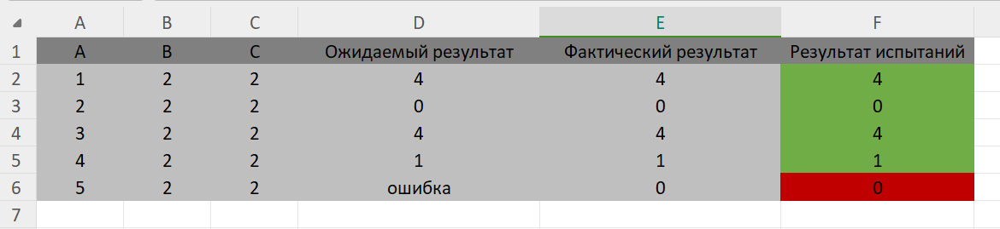

# Отчет по 2 практике тестирование

```python
def add(x, y):
    return x + y

def subtract(x, y):
    return x - y

def multiply(x, y):
    return x * y

def divide(x, y):
    if y == 0:
        return "Ошибка: Деление на ноль!"
    return x // y  

def calculator():
    print("Выберите операцию:")
    print("1. Сложение")
    print("2. Вычитание")
    print("3. Умножение")
    print("4. Деление")

    choice = input("Введите номер операции (1/2/3/4): ")

    if choice not in ['1', '2', '3', '4']:
        print("Неверный ввод, пожалуйста, выберите номер операции от 1 до 4.")
        return  


    num1 = int(input("Введите первое число: "))
    num2 = int(input("Введите второе число: "))

    if choice == '1':
        print(f"{num1} + {num2} = {add(num1, num2)}")  
    elif choice == '2':
        print(f"{num1} - {num2} = {subtract(num1, num2)}")  
    elif choice == '3':
        print(f"{num1} * {num2} = {multiply(num1, num2)}") 
    elif choice == '4':
        print(f"{num1} / {num2} = {divide(num1, num2)}")  

if __name__ == "__main__":
    calculator()

```


